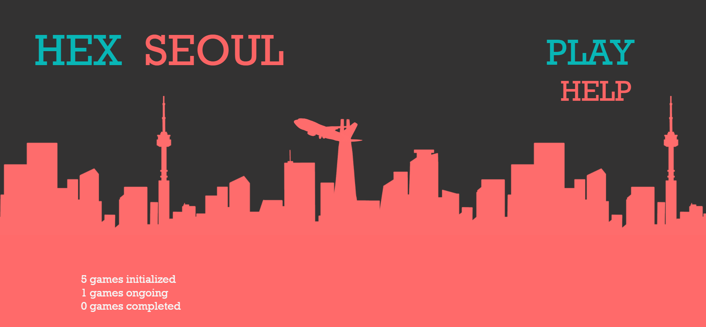
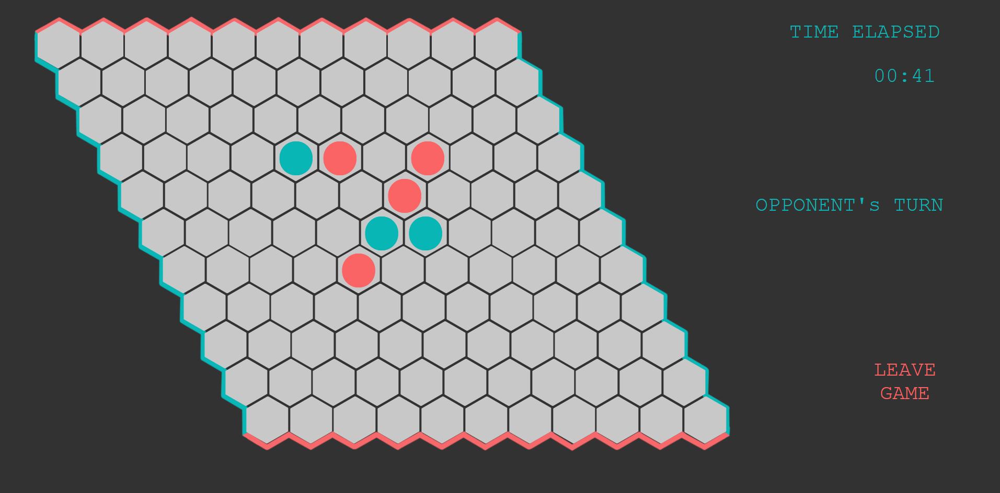

# HEX SEOUL (Group CSE1 61)


This board game is an assignment done for the Web technology part of CSE1500, the first-year *Database and Web Technology* course within TU Delft's computer science curriculum. 

The aim of the game is to form a line that connects the opposite sides of the color. A piece may only be placed in an empty hexagon. Pressing the play button will either allow you to create a new game or join a game. If you are the red player, you will see "YOUR TURN" in red and if you are the blue player, you will see "OPPONENT"S TURN" in red when the game starts.

Please do not refresh the page during a game as that will make you disconnect from the current game and join a new one. 

To start the game, execute the following steps in the terminal:

```
cd HexSeoul
npm install
npm start
```

You can now access the game at http://localhost:3000/ in the browser. Open another browser window to access the game as another player.

Splash Screen Wireframe



The help button will show some basic rules you have to know during the game.

3 statistics show in the bottom-left corner. Refresh to see updated statistics.


Game Screen Wireframe



The 'TIME ELAPSED' shows the total time taken for the game including the waiting time.

You can leave the game with the leave button.


Credit

All images were created by Cherin Kim.

The click sound: https://freesound.org/people/89o/sounds/434130/

Group CSE1 61: Cherin Kim, Jae Seo


Easter eggs 

Click the moving plane in the splash screen to stop it!

Some of the silhouettes in the splash screen are famous buildings in Seoul so try spotting them!

Click the time in the game screen to see it in bold!